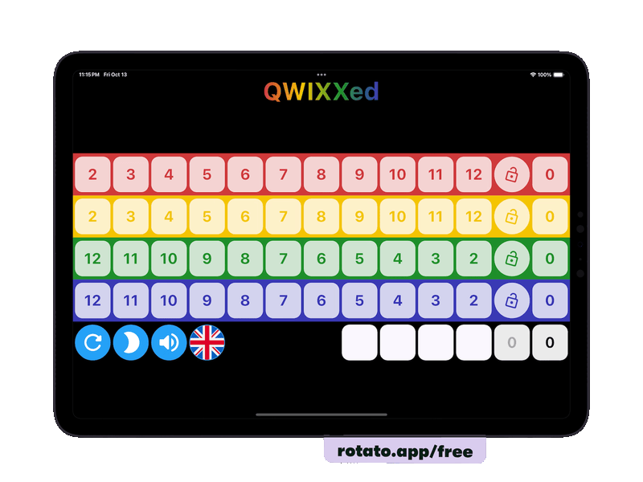

# App Promos

<table>
   <tbody>
      <tr>
        <td class="name">
          
Active Together

          
iOS / Android App to enjoy (sports) activities together. The first version allows you to join sports leagues and is used in Singapore by the Singapore Beach Tennis Club.

        </td>
        <td class="media">
          
        </td>
        <td class="links">
          <a href="https://github.com/jbijlsma/active-together-league-promo">Promo Page</a>
        </td>
      </tr>
      <tr class="black">
        <td class="name">
          
1 for 12

          
iOS / Android App of the popular Dutch TV game show 'Twee voor 12'. You will get 12 questions. The first letters of the answers form a word, but the letters are not yet in the right order. After answering the questions, you are allowed to ask where in the word a letter belongs. The goal is to guess the word as fast as possible (i.e asking the minimum number of letters).

        </td>
        <td class="media">
          
        </td>
        <td class="links">
          <a href="https://github.com/jbijlsma/dnw-one-for-twelve-promo5">Promo Page</a>
        </td>
      </tr>
      <tr>
        <td class="name" colspan=2>
          
QWIXXed

          
iOS, Android, MacOS & Web App that helps you with playing the popular games of QWIXX. It keeps track of your score and offers some useful additional features.

          

        </td>
        <td style="vertical-align: top; padding-top: 20px;">
          <a href="https://github.com/jbijlsma/active-together-league-promo">Promo Page</a>
        </td>
      </tr>
   </tbody>
</table>

Videos were made using Rotato (https://rotato.app/)
